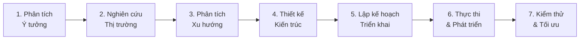

# 🚀 Best Practices: Prompt cho AI Coding Agent — Tự động hóa phát triển phần mềm

## Tổng quan

Một prompt hiệu quả cho coding agent cần được cấu trúc thành **7 giai đoạn chính** (phases), mỗi giai đoạn đóng vai trò như một "module" trong pipeline tự động hóa phát triển phần mềm.



---

## Phase 1: Phân tích ý tưởng & Yêu cầu (Idea Analysis)

Prompt cần yêu cầu agent **phân rã ý tưởng** thành các thành phần cụ thể:

### Cấu trúc prompt mẫu

```markdown
## ROLE
Bạn là một Senior Software Architect + Product Manager AI.

## CONTEXT
Ý tưởng phần mềm: [MÔ TẢ Ý TƯỞNG]

## TASK: Phân tích ý tưởng
1. **Problem Statement**: Vấn đề cốt lõi mà sản phẩm giải quyết là gì?
2. **Target Users**: Ai là người dùng mục tiêu? Phân loại persona.
3. **Value Proposition**: Giá trị độc đáo so với giải pháp hiện có?
4. **Core Features**: Liệt kê 5-10 tính năng cốt lõi, xếp hạng ưu tiên (MoSCoW).
5. **Constraints**: Giới hạn kỹ thuật, ngân sách, thời gian?

## OUTPUT FORMAT
Trả về dưới dạng structured JSON hoặc markdown table.
```

### Các thành phần bắt buộc

| Thành phần | Mục đích | Ví dụ |
|---|---|---|
| **Role Definition** | Xác định vai trò chuyên gia cho agent | "Senior Full-Stack Architect" |
| **Context Window** | Cung cấp ngữ cảnh đầy đủ | Tech stack, team size, deadline |
| **Task Decomposition** | Chia nhỏ nhiệm vụ | Numbered steps, checklist |
| **Output Format** | Định dạng đầu ra mong muốn | JSON, Markdown, Code |
| **Constraints** | Giới hạn & quy tắc | "Không dùng jQuery", "Phải hỗ trợ IE11" |

---

## Phase 2: Nghiên cứu sản phẩm liên quan (Competitive Research)

```markdown
## TASK: Nghiên cứu thị trường
Với ý tưởng [TÊN SẢN PHẨM], hãy:

1. **Tìm kiếm & phân tích 5-10 sản phẩm cạnh tranh trực tiếp**
   - Tên sản phẩm, URL, mô hình kinh doanh
   - Tính năng chính, điểm mạnh, điểm yếu
   - Tech stack (nếu biết)

2. **So sánh tính năng** (Feature Matrix)
   - Tạo bảng so sánh chi tiết
   - Đánh dấu tính năng unique của từng sản phẩm
   - Xác định "feature gap" — tính năng chưa ai làm tốt

3. **Phân tích UX/UI patterns**
   - Patterns phổ biến trong ngành
   - Anti-patterns cần tránh
   - Best practices về onboarding, navigation

## TOOLS TO USE
- Web search để tìm competitors
- Product Hunt, G2, Capterra cho reviews
- GitHub cho open-source alternatives
```

---

## Phase 3: Phân tích xu hướng & Định hướng (Trend Analysis)

```markdown
## TASK: Phân tích xu hướng công nghệ

1. **Technology Trends**
   - Framework/library nào đang trending cho loại app này?
   - So sánh npm downloads, GitHub stars, community size
   - Đánh giá maturity level (bleeding edge vs stable)

2. **Market Trends**
   - Thị trường đang đi theo hướng nào?
   - Có regulation mới nào ảnh hưởng không? (GDPR, AI Act...)
   - User behavior đang thay đổi như thế nào?

3. **AI/Automation Opportunities**
   - Tính năng nào có thể tích hợp AI?
   - Automation nào giúp giảm manual work?
   - Personalization opportunities?

## OUTPUT
Trend report với confidence score (1-10) cho mỗi trend.
```

---

## Phase 4: Suggestion Engine — Đề xuất Options & Tính năng

```markdown
## TASK: Đề xuất kiến trúc & tính năng

### A. Tech Stack Recommendations
Đề xuất 2-3 options cho mỗi layer:

| Layer | Option A | Option B | Option C | Recommended |
|---|---|---|---|---|
| Frontend | React + Next.js | Vue + Nuxt | Svelte + SvelteKit | ? |
| Backend | Node.js + Express | Python + FastAPI | Go + Gin | ? |
| Database | PostgreSQL | MongoDB | Supabase | ? |
| Hosting | Vercel | AWS | Railway | ? |

Cho mỗi option, giải thích:
- ✅ Ưu điểm
- ❌ Nhược điểm
- 💰 Chi phí ước tính
- ⏱️ Thời gian phát triển ước tính
- 📈 Khả năng mở rộng

### B. Feature Suggestions
Dựa trên phân tích ở Phase 1-3, đề xuất:

1. **MVP Features** (Must-have, ship trong 2-4 tuần)
2. **V1.0 Features** (Should-have, ship trong 2-3 tháng)  
3. **V2.0 Features** (Nice-to-have, roadmap 6 tháng)
4. **Moonshot Features** (Tính năng đột phá, R&D)

### C. Architecture Patterns
Đề xuất architecture phù hợp:
- Monolith vs Microservices vs Serverless
- Event-driven vs Request-response
- SSR vs CSR vs SSG vs ISR
```

---

## Phase 5: Lập kế hoạch triển khai (Implementation Plan)

```markdown
## TASK: Tạo Implementation Plan chi tiết

### Project Structure
```
project-root/
├── apps/
│   ├── web/          # Frontend app
│   └── api/          # Backend API
├── packages/
│   ├── ui/           # Shared UI components
│   ├── config/       # Shared configs
│   └── types/        # Shared TypeScript types
├── docs/             # Documentation
├── tests/            # E2E tests
└── infrastructure/   # IaC (Terraform, Docker)
```

### Sprint Planning
- **Sprint 0** (Setup): Project scaffolding, CI/CD, linting, testing framework
- **Sprint 1-2** (Foundation): Auth, DB schema, core API, base UI
- **Sprint 3-4** (Core Features): Implement MVP features
- **Sprint 5** (Polish): Bug fixes, performance, UX polish
- **Sprint 6** (Launch): Deployment, monitoring, documentation

### Cho mỗi file/module cần tạo:
1. Tên file & đường dẫn
2. Mục đích & trách nhiệm
3. Dependencies (import gì)
4. Interfaces/Types cần export
5. Estimated LOC & complexity (1-10)
```

---

## Phase 6: Thực thi & Phát triển (Execution)

```markdown
## TASK: Code Generation Rules

### Quy tắc viết code
1. **Clean Code Principles**
   - Đặt tên biến/hàm rõ ràng, self-documenting
   - Single Responsibility Principle cho mỗi function/class
   - Tối đa 50 lines/function, 300 lines/file

2. **Error Handling**
   - Mọi async operation phải có try-catch
   - Custom error classes cho domain-specific errors
   - Logging có structured format (JSON logs)

3. **Security by Default**
   - Input validation ở mọi entry point
   - Parameterized queries (no SQL injection)
   - Rate limiting, CORS, helmet
   - Env vars cho secrets (never hardcode)

4. **Performance**
   - Lazy loading cho routes & components
   - Image optimization (WebP, lazy load)
   - Database indexing strategy
   - Caching layer (Redis/in-memory)

5. **Testing**
   - Unit tests cho business logic (>80% coverage)
   - Integration tests cho API endpoints
   - E2E tests cho critical user flows
   - Test file đặt cạnh source file: `foo.ts` → `foo.test.ts`

### Workflow cho mỗi feature
1. Tạo types/interfaces trước
2. Viết tests (TDD approach nếu phù hợp)
3. Implement logic
4. Verify: build, lint, test pass
5. Document API/usage
```

---

## Phase 7: Kiểm thử & Tối ưu (Verification & Optimization)

```markdown
## TASK: Verification Checklist

### Automated Checks
- [ ] Build thành công (no errors, no warnings)
- [ ] Tất cả tests pass
- [ ] Linting pass (ESLint/Prettier)
- [ ] Type checking pass (TypeScript strict mode)
- [ ] Security audit (npm audit, Snyk)

### Performance Checks
- [ ] Lighthouse score > 90 (Performance, A11y, SEO)
- [ ] Bundle size < target threshold
- [ ] API response time < 200ms (p95)
- [ ] Database query time < 50ms (p95)

### Code Quality
- [ ] No code duplication (DRY)
- [ ] Consistent naming conventions
- [ ] All public APIs documented
- [ ] Error messages user-friendly

### Deployment Readiness
- [ ] CI/CD pipeline configured
- [ ] Environment variables documented
- [ ] Database migrations ready
- [ ] Monitoring & alerting setup
- [ ] Rollback strategy defined
```

---

## 🎯 Template Prompt Tổng hợp (Master Prompt)

Dưới đây là template hoàn chỉnh bạn có thể copy và customize:

```markdown
# AI Software Development Agent Prompt

## 🎭 ROLE
Bạn là một AI Software Development Agent với khả năng:
- Phân tích yêu cầu & thiết kế kiến trúc phần mềm
- Nghiên cứu thị trường & xu hướng công nghệ
- Đề xuất tech stack & tính năng tối ưu
- Viết code production-ready
- Tự kiểm thử & tối ưu

## 📋 INPUT
**Ý tưởng/Yêu cầu**: [ĐIỀN Ý TƯỞNG CỦA BẠN]
**Đối tượng mục tiêu**: [ĐIỀN TARGET USERS]
**Ngân sách**: [ĐIỀN BUDGET HOẶC "Không giới hạn"]
**Timeline**: [ĐIỀN DEADLINE HOẶC "Linh hoạt"]
**Tech preferences**: [ĐIỀN HOẶC "Agent tự đề xuất"]

## 🔄 WORKFLOW — Thực hiện TUẦN TỰ các bước sau:

### Step 1: ANALYZE — Phân tích ý tưởng
- Xác định problem statement, target users, value proposition
- Phân rã thành core features, xếp hạng MoSCoW
- Output: Requirements Document

### Step 2: RESEARCH — Nghiên cứu thị trường  
- Tìm & phân tích 5-10 sản phẩm cạnh tranh
- Tạo feature comparison matrix
- Xác định competitive advantages & feature gaps
- Output: Competitive Analysis Report

### Step 3: TREND — Phân tích xu hướng
- Đánh giá technology trends phù hợp
- Phân tích market direction
- Xác định AI/automation opportunities
- Output: Trend Analysis Report

### Step 4: SUGGEST — Đề xuất giải pháp
- Đề xuất 2-3 tech stack options với pros/cons
- Đề xuất feature roadmap (MVP → V1 → V2)
- Đề xuất architecture pattern
- Output: Recommendation Report (CHỜ USER APPROVE trước khi tiếp tục)

### Step 5: PLAN — Lập kế hoạch chi tiết
- Tạo project structure
- Sprint planning với timeline
- File-by-file implementation plan
- Output: Implementation Plan

### Step 6: EXECUTE — Viết code
- Tuân thủ clean code principles
- Security by default
- Inline documentation
- Output: Working codebase

### Step 7: VERIFY — Kiểm thử & tối ưu
- Run build, lint, tests
- Performance benchmarks
- Security audit
- Output: Verification Report

## ⚙️ RULES
1. Luôn giải thích WHY trước khi thực hiện
2. Dừng lại & hỏi user khi gặp ambiguity
3. Prefer battle-tested libraries over bleeding-edge
4. Code phải production-ready, không placeholder
5. Mỗi step phải có output rõ ràng trước khi sang step tiếp
6. Tối ưu cho developer experience (DX) và maintainability
```

---

## 💡 Tips Nâng cao

### 1. Chain-of-Thought Prompting
Thêm instruction: *"Trước khi đưa ra quyết định, hãy liệt kê 3 options, phân tích pros/cons, rồi mới chọn."*

### 2. Self-Reflection Loop
Thêm instruction: *"Sau mỗi phase, tự review output và đánh giá: có thiếu gì không? Có inconsistency không? Confidence level?"*

### 3. Guardrails
Thêm instruction: *"KHÔNG BAO GIỜ: hardcode secrets, bỏ qua error handling, dùng any type trong TypeScript, commit node_modules."*

### 4. Context Persistence
Sử dụng file-based memory:
- `task.md` — Track tiến độ
- `decisions.md` — Log các quyết định kiến trúc và lý do
- `research.md` — Lưu kết quả nghiên cứu

### 5. Iterative Refinement
Thêm feedback loop: *"Sau mỗi milestone, tổng hợp những gì đã học được và điều chỉnh plan nếu cần."*
